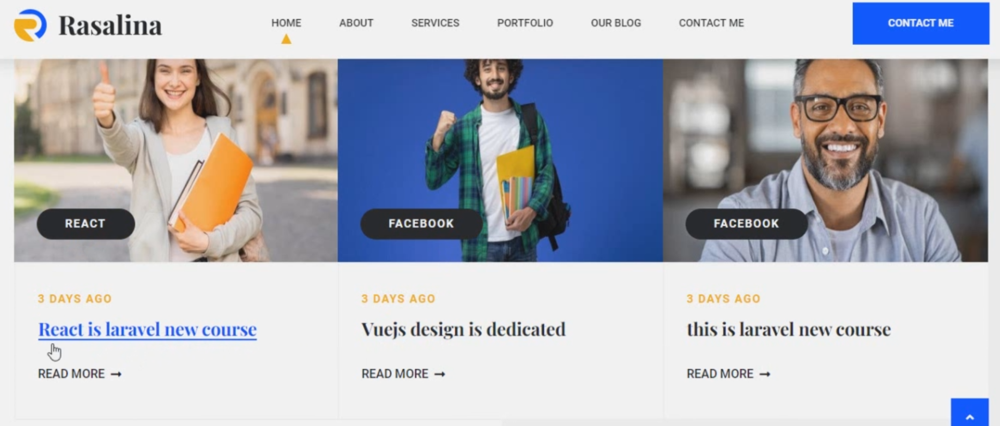

# Laravel 9 Basic Foundation with Complete Website

## 1. Introduction What We will Create

sample screen shot of the project




## 3. Essential Environment Setup

### instal xampp

[instal](https://www.apachefriends.org/download.html)
and enable the gd extension in the php.ini file.

go to this url
[localhost](http://localhost/dashboard/)
[php info](http://localhost/dashboard/phpinfo.php)
[php myadmin](http://localhost/dashboard/phpmyadmin/)

### install nodejs

[nodejs](https://nodejs.org/en/download/)

### install composer

[composer](https://getcomposer.org/download/)

## Laravel 9 Installation

got to the desired location and create your project

```shell
🦤_> composer create-project laravel/laravel my-project
```

## Discuss on Laravel Folder Structure

## What is MVC and Its Benefits

## What is Route

## Laravel Blade Syntax

## How to Make Controller And Get Url Request Part 1

## How to Make Controller And Get Url Request Part 2

## Middleware
