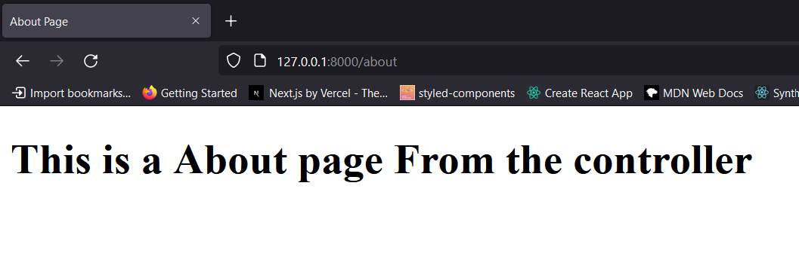
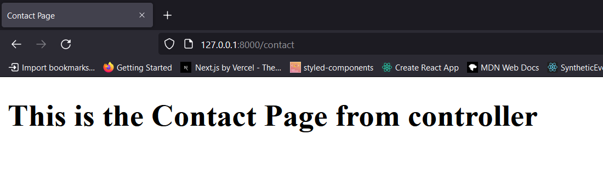

# Laravel 9 Basic Foundation with Complete Website

- [Laravel 9 Basic Foundation with Complete Website](#laravel-9-basic-foundation-with-complete-website)
  - [1. Introduction What We will Create](#1-introduction-what-we-will-create)
  - [3. Essential Environment Setup](#3-essential-environment-setup)
    - [instal xampp](#instal-xampp)
    - [install nodejs](#install-nodejs)
    - [install composer](#install-composer)
  - [Laravel 9 Installation](#laravel-9-installation)
    - [output](#output)
  - [Discuss on Laravel Folder Structure](#discuss-on-laravel-folder-structure)
    - [package.json](#packagejson)
    - [.env](#env)
    - [we have middleware](#we-have-middleware)
    - [controllers](#controllers)
    - [Models](#models)
    - [config](#config)
    - [📂 database](#-database)
    - [📂 public](#-public)
    - [📂 resources/views](#-resourcesviews)
    - [📂 route](#-route)
    - [let's change the welcome blade file](#lets-change-the-welcome-blade-file)
  - [What is MVC and Its Benefits](#what-is-mvc-and-its-benefits)
    - [what is mvc](#what-is-mvc)
    - [Benefits of mvc](#benefits-of-mvc)
    - [Simple Example](#simple-example)
  - [What is Route](#what-is-route)
    - [Controller and View In Action](#controller-and-view-in-action)
  - [LAravel Routes](#laravel-routes)
    - [let's create contact and about blade files](#lets-create-contact-and-about-blade-files)
      - [about page](#about-page)
      - [contact page](#contact-page)
      - [web.php](#webphp)
  - [Laravel Blade Syntax](#laravel-blade-syntax)
  - [How to Make Controller And Get Url Request Part 1](#how-to-make-controller-and-get-url-request-part-1)
    - [this is what we have now in the web.php](#this-is-what-we-have-now-in-the-webphp)
    - [Let’s make a controller](#lets-make-a-controller)
    - [Importing the Controller](#importing-the-controller)
    - [Demo Controller](#demo-controller)
    - [Let’s do the same thing to the contact page](#lets-do-the-same-thing-to-the-contact-page)
    - [Laravel 9 way Route::controller](#laravel-9-way-routecontroller)
  - [How to Make Controller And Get Url Request Part 2](#how-to-make-controller-and-get-url-request-part-2)
  - [Middleware](#middleware)

## 1. Introduction What We will Create

sample screen shot of the project


## 3. Essential Environment Setup

### instal xampp

[instal](https://www.apachefriends.org/download.html)
and enable the gd extension in the php.ini file.

go to this url
[localhost](http://localhost/dashboard/)
[php info](http://localhost/dashboard/phpinfo.php)
[php myadmin](http://localhost/dashboard/phpmyadmin/)

### install nodejs

[nodejs](https://nodejs.org/en/download/)

### install composer

[composer](https://getcomposer.org/download/)

## Laravel 9 Installation

got to the desired location and create your project

```shell
🦤_> composer create-project laravel/laravel my-project
```

### output


## Discuss on Laravel Folder Structure

### package.json

```json
{
    "private": true,
    "scripts": {
        "dev": "vite",
        "build": "vite build"
    },
    "devDependencies": {
        "axios": "^0.25",
        "laravel-vite-plugin": "^0.4.0",
        "lodash": "^4.17.19",
        "postcss": "^8.1.14",
        "vite": "^2.9.11"
    }
}
```

### .env

here we have the environment variables

- here we can add the database configuration
- mailing function configurations also can be added here

```env
APP_NAME=Laravel
APP_ENV=local
APP_KEY=base64:N/BjjmPm9Xtw6U+L9VDYYUyTakzxZZzAEY1paMrQAJw=
APP_DEBUG=true
APP_URL=http://localhost

LOG_CHANNEL=stack
LOG_DEPRECATIONS_CHANNEL=null
LOG_LEVEL=debug

DB_CONNECTION=mysql
DB_HOST=127.0.0.1
DB_PORT=3306
DB_DATABASE=laravel
DB_USERNAME=root
DB_PASSWORD=

BROADCAST_DRIVER=log
CACHE_DRIVER=file
FILESYSTEM_DISK=local
QUEUE_CONNECTION=sync
SESSION_DRIVER=file
SESSION_LIFETIME=120

MEMCACHED_HOST=127.0.0.1

REDIS_HOST=127.0.0.1
REDIS_PASSWORD=null
REDIS_PORT=6379

MAIL_MAILER=smtp
MAIL_HOST=mailhog
MAIL_PORT=1025
MAIL_USERNAME=null
MAIL_PASSWORD=null
MAIL_ENCRYPTION=null
MAIL_FROM_ADDRESS="hello@example.com"
MAIL_FROM_NAME="${APP_NAME}"

AWS_ACCESS_KEY_ID=
AWS_SECRET_ACCESS_KEY=
AWS_DEFAULT_REGION=us-east-1
AWS_BUCKET=
AWS_USE_PATH_STYLE_ENDPOINT=false

PUSHER_APP_ID=
PUSHER_APP_KEY=
PUSHER_APP_SECRET=
PUSHER_HOST=
PUSHER_PORT=443
PUSHER_SCHEME=https
PUSHER_APP_CLUSTER=mt1

VITE_PUSHER_APP_KEY="${PUSHER_APP_KEY}"
VITE_PUSHER_HOST="${PUSHER_HOST}"
VITE_PUSHER_PORT="${PUSHER_PORT}"
VITE_PUSHER_SCHEME="${PUSHER_SCHEME}"
VITE_PUSHER_APP_CLUSTER="${PUSHER_APP_CLUSTER}"

```

### we have middleware

- with middleware we can control the flow of the application

### controllers

- MVC controllers are located there.

### Models

- Models are the data that is stored in the database.

### config

- config is the configuration file.

### 📂 database

- all the files related to the database are stored here.

### 📂 public

- all the files related to the public are stored here.
- css,js,images and etc ..

### 📂 resources/views

- all the files related to the views are stored here.
- .blade.php files

### 📂 route

- all the files related to the routes are stored here.
- like api and web

### let's change the welcome blade file

let's remove all code from this file.

## What is MVC and Its Benefits

### what is mvc


### Benefits of mvc


### Simple Example


## What is Route

### Controller and View In Action


## LAravel Routes

### let's create contact and about blade files

#### about page

```php
<!DOCTYPE html>
<html lang="en">
<head>
    <meta charset="UTF-8">
    <meta http-equiv="X-UA-Compatible" content="IE=edge">
    <meta name="viewport" content="width=device-width, initial-scale=1.0">
    <title>About Page</title>
</head>
<body>
<h1>This is a About page</h1>
</body>
</html>
```

#### contact page

```php
<!DOCTYPE html>
<html lang="en">

<head>
    <meta charset="UTF-8">
    <meta http-equiv="X-UA-Compatible" content="IE=edge">
    <meta name="viewport" content="width=device-width, initial-scale=1.0">
    <title>Contact Page</title>
</head>

<body>
<h1>This is the Contact Page</h1>
</body>

</html>

```

#### web.php

```php
<?php

use Illuminate\Support\Facades\Route;

/*
|--------------------------------------------------------------------------
| Web Routes
|--------------------------------------------------------------------------
|
| Here is where you can register web routes for your application. These
| routes are loaded by the RouteServiceProvider within a group which
| contains the "web" middleware group. Now create something great!
|
*/

Route::get('/', function () {
    return view('welcome');
});

Route::get('/about', function () {
    return view('about');
});

Route::get('/contact', function () {
    return view('contact');
});
```

## Laravel Blade Syntax

```blade
<?php

$world = "Hi Arian";

echo $world;

{{$world}}

@if(){

}
@endif

@foreach (){

}

@endForeach

```

## How to Make Controller And Get Url Request Part 1

### this is what we have now in the web.php

```php
<?php

use Illuminate\Support\Facades\Route;

Route::get('/', function () {
    return view('welcome');
});

Route::get('/about', function () {
    return view('about');
});

Route::get('/contact', function () {
    return view('contact');
});

```

let's use the controllers to pass the view instead of the view file.

### Let’s make a controller

```bash
⮞  php artisan make:controller Demo/DemoController

Controller created successfully.

```

Let’s control our views using this newly created controller.

### Importing the Controller

So the first we have to use the route and the HTTP method inside the HTTP method. we have to 1st add the route url. Then inside square brackets we can add the controller and the method we want to execute.

```php
<?php

use App\Http\Controllers\Demo\DemoController;
use Illuminate\Support\Facades\Route;

Route::get('/', function () {
    return view('welcome');
});
// example
Route::get('/about', [DemoController::class, 'Index']);

Route::get('/contact', function () {
    return view('contact');
});
```

Now let’s go to the controller.
method will do the same thing we did in the web PHP file.

### Demo Controller

```php
<?php

namespace App\Http\Controllers\Demo;

use App\Http\Controllers\Controller;

class DemoController extends Controller
{
    function Index()
    {
        return view('about');
    }
}

```

This is our About page.

```html
<!DOCTYPE html>
<html lang="en">
<head>
    <meta charset="UTF-8">
    <meta http-equiv="X-UA-Compatible" content="IE=edge">
    <meta name="viewport" content="width=device-width, initial-scale=1.0">
    <title>About Page</title>
</head>
<body>
<h1>This is a About page From the controller</h1>
</body>
</html>


```

Let’s  test this.


### Let’s do the same thing to the contact page

```php
Route::get('/contact', [DemoController::class, 'Contact']);
```

This is our contact method in the controller.

```php
 function Contact()
    {
        return view('contact');
    }
```

This is our contact page.

```html
<!DOCTYPE html>
<html lang="en">

<head>
    <meta charset="UTF-8">
    <meta http-equiv="X-UA-Compatible" content="IE=edge">
    <meta name="viewport" content="width=device-width, initial-scale=1.0">
    <title>Contact Page</title>
</head>

<body>
<h1>This is the Contact Page from controller</h1>
</body>

</html>

```

test

;

### Laravel 9 way Route::controller

In Laravel 8 all other old versions every time we have to mention the controller name But in Laravel 9 there’s a new way.

```php
Route::controller(DemoController::class)->group(function () {
    Route::get('/about', 'Index');
    Route::get('/contact', 'Contact');
});
```

So in here we don’t have to mention the controller name each and every time we use the controller we can group the methods that are using by the same controller into a route controller group.

test
;

## How to Make Controller And Get Url Request Part 2

```php

```

###

###

## Middleware
